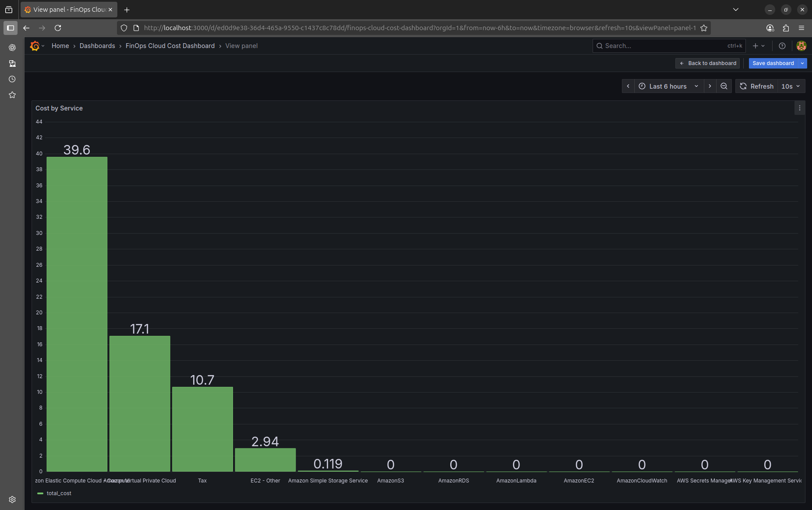
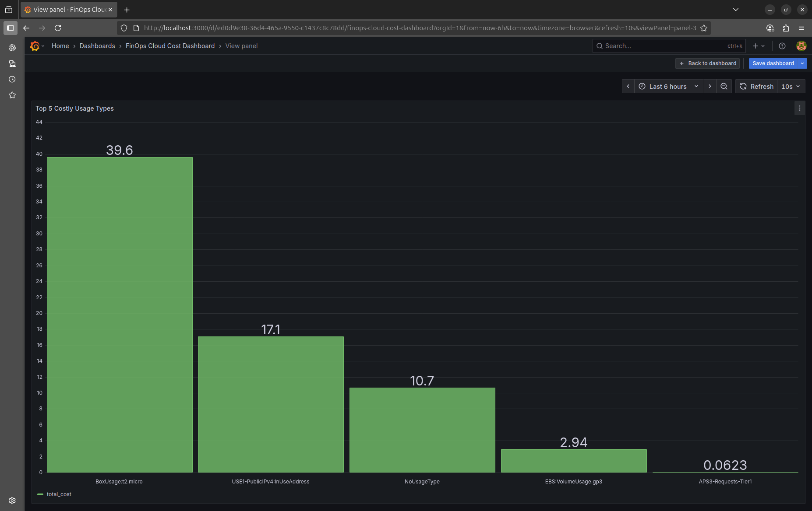
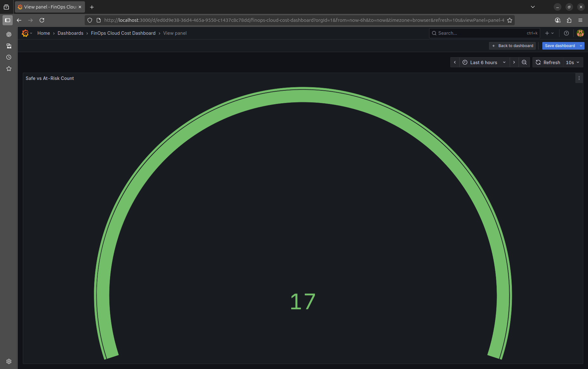
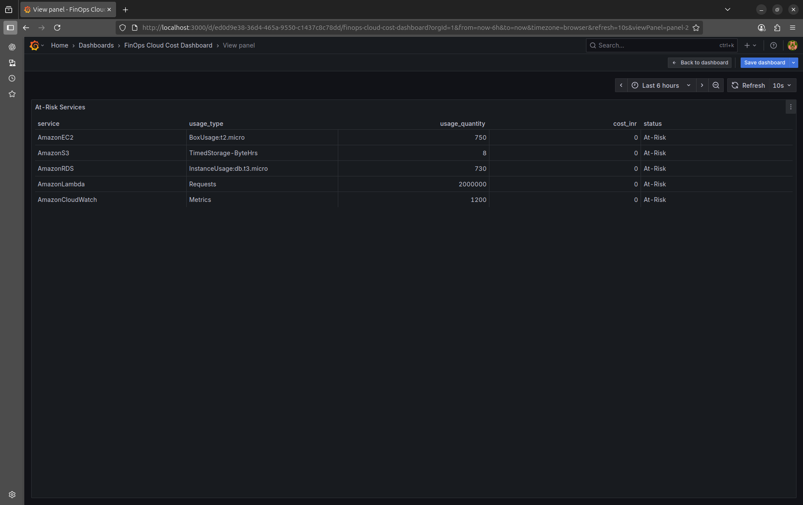

# FinOps Cloud Cost Optimization Dashboard

Small utility to fetch AWS Cost & Usage data, store it in a local SQLite DB, and prepare it for visualization / analysis.

## Repo layout
finops-cloud-cost-optimization-dashboard/
- scripts/
  - main.py          # orchestrates fetch + insert into sqlite
  - fetch_api.py     # calls AWS Cost Explorer and returns rows
  - update_status.py # new: auxiliary script (status/update utilities)
- db/
  - usage.db         # SQLite DB (gitignored)
- docs/
  - setup.md         # AWS CLI / credentials setup
- screenshots/
  - At-RiskServices.png
  - CostByService.png
  - SafeVsAt-RiskCount.png
  - Top5CostlyUsageTypes.png
- .env               # environment variables (gitignored)
- requirements.txt
- README.md

## Features
- Fetches AWS Cost Explorer data for a given time range
- Persists aggregated usage/cost rows into a SQLite table `usage`
- Table has UNIQUE(date, service, usage_type) to avoid duplicate inserts

## Requirements
- Python 3.10+ (recommended)
- pip, virtualenv
- AWS account with Cost Explorer access and programmatic credentials
- See `requirements.txt` for Python packages

## Quick setup

1. Create and activate virtualenv
```bash
python -m venv venv
source venv/bin/activate
pip install -r requirements.txt
```

2. Configure AWS credentials (see docs/setup.md)
```bash
aws configure
# or set credentials in .env as described below
```

3. Create `db/` directory and set .env
```bash
mkdir -p db
```

Create a `.env` file at repo root with the following (example):
```
AWS_ACCESS_KEY_ID=AKIA...
AWS_SECRET_ACCESS_KEY=...
AWS_REGION=us-east-1
DATABASE_NAME=db/usage.db
INRConstant=82.5
```

- DATABASE_NAME can be a relative path (recommended `db/usage.db`) or absolute path.
- INRConstant is the conversion factor applied to USD cost (as used in fetch_api.py).

## Running
Always run from the project root (not from inside `scripts/`) to avoid import issues:

```bash
python scripts/main.py
```

What it does:
- Calls `fetch_api.fetch_cost_data(start, end)`
- Converts returned rows to a DataFrame and inserts into `usage` table using `INSERT OR IGNORE` (idempotent)
- Prints first 5 rows as a quick check

## Screenshots

Below are sample visuals generated/used with this project (stored under `screenshots/`):









## Database schema
The `usage` table columns:
- id INTEGER PRIMARY KEY AUTOINCREMENT
- date TEXT
- service TEXT
- usage_type TEXT
- usage_quantity REAL
- usage_unit TEXT
- cost_inr REAL
 - status TEXT

Unique constraint: UNIQUE(date, service, usage_type)

## Troubleshooting

- ModuleNotFoundError: No module named 'scripts'  
  Cause: running `python main.py` from inside `scripts/`. Fix:
  ```bash
  cd /path/to/finops-cloud-cost-optimization-dashboard
  python scripts/main.py
  ```

- sqlite3.OperationalError: unable to open database file  
  Cause: wrong path or missing directory. Fix:
  ```bash
  mkdir -p db
  # ensure DATABASE_NAME in .env points to db/usage.db
  ```

- AWS auth / permissions: ensure the AWS credentials have Cost Explorer read permissions and Cost Explorer is enabled for the account.

## Notes
- `fetch_api.py` expects Cost Explorer response structure; costs are converted to INR using `INRConstant` from `.env`.
- For production or multi-user usage, consider a managed DB and secure secret storage.

### Updating "status"
Run the helper to assign Safe/At-Risk based on simple thresholds:

```bash
python scripts/update_status.py
```
This updates the `status` column for each row in `usage`.

## Alert/flag logic

The script `scripts/update_status.py` flags each row as "At-Risk" or "Safe" based on `service` and `usage_quantity`:

- AmazonEC2: At-Risk if usage_quantity > 720 (e.g., hours/month)
- AmazonRDS: At-Risk if usage_quantity > 720 (e.g., hours/month)
- AmazonS3: At-Risk if usage_quantity > 5 (e.g., TB or a chosen unit)
- AmazonLambda: At-Risk if usage_quantity > 1,000,000 (invocations)
- AmazonCloudWatch: At-Risk if usage_quantity > 1000 (metrics/logs as per unit)
- Otherwise: Safe

Notes
- `usage_quantity` is coerced to float; non-numeric values default to 0.
- Thresholds are hard-coded in `update_status.py`. Adjust them to fit your environment or convert them to config/envs if needed.

## License 

This project is licensed under the MIT License.
